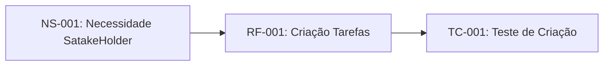

# Sistemas de Gestão de Tarefas

## 1. Introdução

## 1.1 Propósito do Projeto 

Este documento especifica os requisitos funcionais e não-funcionais para o Sistema de Gestão de tarefas (SGT), seguindo o padrão IEEE 29148:2018

### 1.2 Escopo

O SGT permitirá que ususário criem, organizem e acompahem tarefas pessoais eprofissionais com sistemas de propriedades prazos 

### 1.3 Definção e Acrônomias 

- **SGT**: Sistema de Gestão de Tarefas
- **RF**: Requisitos Funcional
- **RNF**: Requisitos Não-Funcional
- **Script**: Periódo de 2 semanans de desenvolvimento

### 1.4 Referências

- IEEE 28148:2018 - Ystems and software engineering
- CMMI for Development. Version 2.0.

## 2. Descrinção Geral

### 2.1 PErspectiva do Produto

O SGT será uma aplicação web reponsiva com sincronização de nuvens 

### 2.2 Funções Principais 

- Criação e edição de tarefas 
- Organização por projetos e tags
- Sistema de notificação
- Relatorios de produtividade

## 3. Requisitos Específicos

### 3.1 Requisitos Funcionais

#### RF-001: Criação de Tarefas

**Descrinção**: Osisitema deve permitir que usuários criemm tarefas com título, descrinção, data de vencimento e prioridade.
**Prioridade**: Alta
**Versão**: 1.0
**Data**: 2026-03-27
**Rastreabilidade**: Derivando da necessidade do stakeholders NS-001

**Critérios de Aceitação**:

- [ ] Tarefas podem ser atribuidas um ou nehum projeto
- [ ] Visualização filtrada por projeto
- [ ] Usuário pode criar, renomear e excluuir projetos

**Dependências**: RF-001

---

### 3.2 Requisitos Não funcionais 

#### RNF-001: Desenpenho 

**Descrinção**: O sistema deve carregar a lista de tarefas em menos de 1 segundo para até 100 tarefas
**Categoria**: Desenpenho.
**Prioridade**: Alta
**Versão**: Alta
**Métrica: Tempo de Resposta < 1s para 95% das rquisições

---

#### RNF-002: Segurança

**Descrinção**: O Sistema deve implementar autenticação OAuth 2.0 e criptografia TLS 1.3
**Categoria**: Segurança.
**Prioridade**: Crítica.
**Conformidade**: LGPD, ECADigital

---

## 4. Controle de Versões

### 4.1 Histórico de Alterações

| Versão | Data | Autor | Modificação |
|--------|------|--------|------------|
| 1.0    |2026-03-27| Equipe de Análise | Versão inicial do documento |

### 4.2 Rastreabilidade do Requisito 

Infográfio de Rastreaibilidade do Requisito

